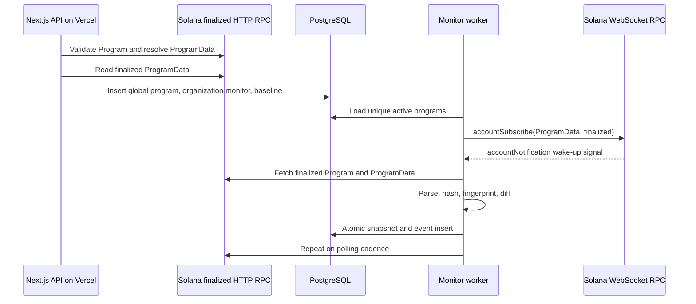

# Milestone 1-2 architecture

## Runtime flow

## Trust boundary

The WebSocket payload is never persisted as proof and never directly creates an event. It only schedules reconciliation. The finalized HTTP account reads are validated for owner, executable state, loader variant, and minimum length before any bytes are interpreted.

## Organization model

`programs` is the global chain identity table, unique by cluster and address. `organization_program_monitors` maps any number of organizations to that identity. Snapshots and change events are collected once globally and can later fan out to organization-specific policies and notifications.

## Snapshot identity

The fingerprint hashes a canonical JSON object containing program owner, ProgramData address, deployment slot, executable hash and size, full account-data hash, upgrade authority, and optional IDL/metadata/source hashes. Observation time, RPC context slot, and verification labels are evidence metadata but are excluded from identity so two providers observing the same state produce the same fingerprint.

## Event rules

Milestone 1 aggregate events used rule-engine version `1`. Milestone 2 uses independently typed version `2` events so one snapshot transition can produce several explicit security facts.

The complete severity and evidence contract is documented in [security-rules.md](security-rules.md). Every event stores both snapshot IDs and database uniqueness prevents duplicate event types for the same pair.

## Failure behavior

- A dropped socket reconnects with bounded exponential backoff and jitter.
- Each worker is pinned to one cluster and one matching HTTP/WebSocket endpoint pair.
- Every reconnect triggers finalized reconciliation.
- Polling runs independently of WebSocket traffic.
- Reconciliation failures mark monitoring degraded and remain retryable.
- Duplicate signals serialize per program in-process and are deduplicated again by database constraints.
- RPC responses that do not satisfy the expected schema fail closed.
